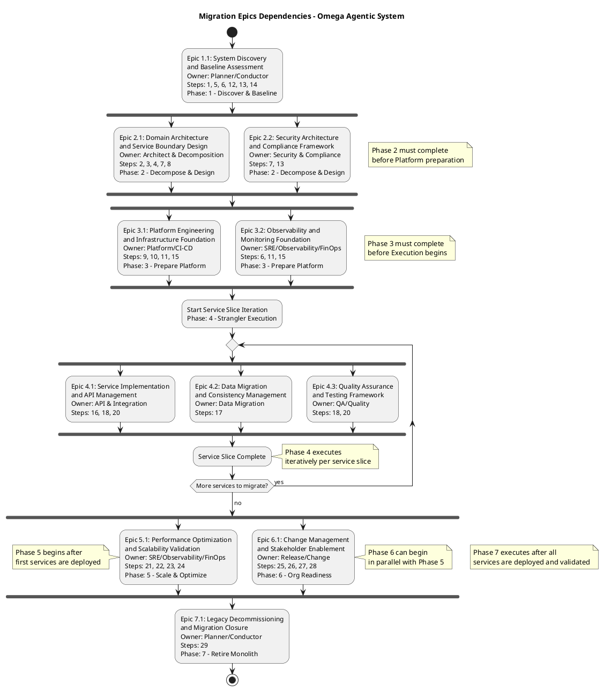

# Migration Epics Dependencies - Activity Diagram

**Document**: Migration Epics Dependencies Visualization  
**Version**: 1.0  
**Date**: November 17, 2025  
**Purpose**: Visual representation of epic execution flow and dependencies across 7 migration phases  
**Diagram Type**: UML Activity Diagram

---

## Overview

This activity diagram visualizes the execution flow and dependencies between migration epics in the Omega Agentic Migration System. The diagram shows how the 9 epics across 7 phases must be coordinated to achieve successful monolith-to-microservices transformation.

## Key Features

- **Sequential Dependencies**: Mandatory phase ordering ensuring proper foundation building
- **Parallel Execution**: Concurrent epic execution where dependencies allow
- **Iterative Patterns**: Phase 4's per-service-slice execution model
- **Agent Ownership**: Primary responsible agent for each epic
- **Synchronization Points**: Clear coordination requirements between phases
- **Color Coding**: Visual phase identification for improved readability

## Dependencies Visualized

1. **Phase 1** (Discovery) must complete before any other phase begins
2. **Phase 2** (Design) must complete before Platform preparation
3. **Phase 3** (Platform) must complete before Execution begins
4. **Phase 4** (Execution) executes iteratively per service slice
5. **Phase 5** (Scaling) begins after first services are deployed
6. **Phase 6** (Org Readiness) can begin in parallel with Phase 5
7. **Phase 7** (Retirement) executes after all services are deployed and validated

---

## Activity Diagram

---

## Usage Context

### For Epic PRD Development
- Reference this diagram when creating detailed PRDs for specific epics
- Understand upstream/downstream dependencies affecting implementation
- Identify supporting agents requiring coordination
- Plan delivery considering parallel execution opportunities

### For Agent Coordination
- **Planner/Conductor**: Overall orchestration and phase transitions
- **Architect & Decomposition**: Foundation for all implementation epics
- **Security & Compliance**: Cross-cutting concerns affecting all phases
- **Platform/CI-CD**: Infrastructure foundation enabling execution
- **API & Integration**: Service implementation with dependency management
- **Data Migration**: Critical path for legacy system retirement
- **QA/Quality**: Validation and quality gates throughout execution
- **SRE/Observability/FinOps**: Performance and operational excellence
- **Release/Change**: Organizational readiness and change management

### For Migration Planning
- Use synchronization points to plan resource allocation
- Leverage parallel execution opportunities to accelerate delivery
- Understand critical path through iterative Phase 4 execution
- Plan risk mitigation around key dependency points

---

## Integration with Framework

This diagram directly supports:
- **Migration Epics Framework**: Visual representation of documented dependencies
- **Agent Modalities**: Clear ownership and collaboration patterns
- **SDLC Integration**: Phase-gate model with quality checkpoints
- **Risk Management**: Dependency visualization for risk assessment

---

*This activity diagram provides the visual foundation for systematic monolith-to-microservices migration execution using the Omega Agentic System.*