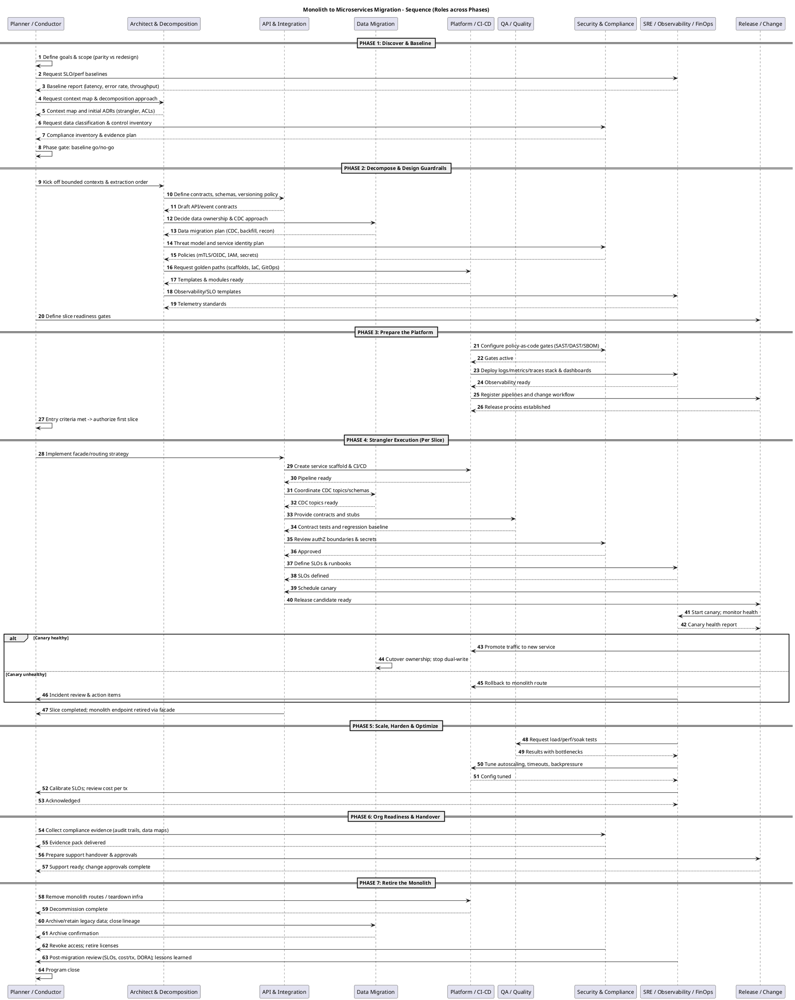

```plantuml
@startuml
title Monolith to Microservices Migration - Sequence (Roles across Phases)
autonumber

' Participants with aliases for clean messages
participant "Planner / Conductor" as Plan
participant "Architect & Decomposition" as Arch
participant "API & Integration" as API
participant "Data Migration" as Data
participant "Platform / CI-CD" as Plat
participant "QA / Quality" as QA
participant "Security & Compliance" as Sec
participant "SRE / Observability / FinOps" as SRE
participant "Release / Change" as Rel

== PHASE 1: Discover & Baseline ==
Plan -> Plan: Define goals & scope (parity vs redesign)
Plan -> SRE: Request SLO/perf baselines
SRE --> Plan: Baseline report (latency, error rate, throughput)
Plan -> Arch: Request context map & decomposition approach
Arch --> Plan: Context map and initial ADRs (strangler, ACLs)
Plan -> Sec: Request data classification & control inventory
Sec --> Plan: Compliance inventory & evidence plan
Plan -> Plan: Phase gate: baseline go/no-go

== PHASE 2: Decompose & Design Guardrails ==
Plan -> Arch: Kick off bounded contexts & extraction order
Arch -> API: Define contracts, schemas, versioning policy
API --> Arch: Draft API/event contracts
Arch -> Data: Decide data ownership & CDC approach
Data --> Arch: Data migration plan (CDC, backfill, recon)
Arch -> Sec: Threat model and service identity plan
Sec --> Arch: Policies (mTLS/OIDC, IAM, secrets)
Arch -> Plat: Request golden paths (scaffolds, IaC, GitOps)
Plat --> Arch: Templates & modules ready
Arch -> SRE: Observability/SLO templates
SRE --> Arch: Telemetry standards
Plan -> Rel: Define slice readiness gates

== PHASE 3: Prepare the Platform ==
Plat -> Sec: Configure policy-as-code gates (SAST/DAST/SBOM)
Sec --> Plat: Gates active
Plat -> SRE: Deploy logs/metrics/traces stack & dashboards
SRE --> Plat: Observability ready
Plat -> Rel: Register pipelines and change workflow
Rel --> Plat: Release process established
Plan -> Plan: Entry criteria met -> authorize first slice

== PHASE 4: Strangler Execution (Per Slice) ==
Plan -> API: Implement facade/routing strategy
API -> Plat: Create service scaffold & CI/CD
Plat --> API: Pipeline ready
API -> Data: Coordinate CDC topics/schemas
Data --> API: CDC topics ready
API -> QA: Provide contracts and stubs
QA --> API: Contract tests and regression baseline
API -> Sec: Review authZ boundaries & secrets
Sec --> API: Approved
API -> SRE: Define SLOs & runbooks
SRE --> API: SLOs defined

Rel -> API: Schedule canary
API -> Rel: Release candidate ready
Rel -> SRE: Start canary; monitor health
SRE --> Rel: Canary health report
alt Canary healthy
  Rel -> Plat: Promote traffic to new service
  Data -> Data: Cutover ownership; stop dual-write
else Canary unhealthy
  Rel -> Plat: Rollback to monolith route
  SRE -> Plan: Incident review & action items
end
API -> Plan: Slice completed; monolith endpoint retired via facade

== PHASE 5: Scale, Harden & Optimize ==
SRE -> QA: Request load/perf/soak tests
QA --> SRE: Results with bottlenecks
SRE -> Plat: Tune autoscaling, timeouts, backpressure
Plat --> SRE: Config tuned
SRE -> Plan: Calibrate SLOs; review cost per tx
Plan --> SRE: Acknowledged

== PHASE 6: Org Readiness & Handover ==
Plan -> Sec: Collect compliance evidence (audit trails, data maps)
Sec --> Plan: Evidence pack delivered
Plan -> Rel: Prepare support handover & approvals
Rel --> Plan: Support ready; change approvals complete

== PHASE 7: Retire the Monolith ==
Plan -> Plat: Remove monolith routes / teardown infra
Plat --> Plan: Decommission complete
Plan -> Data: Archive/retain legacy data; close lineage
Data --> Plan: Archive confirmation
Sec -> Plan: Revoke access; retire licenses
SRE -> Plan: Post-migration review (SLOs, cost/tx, DORA); lessons learned
Plan -> Plan: Program close

@enduml
```