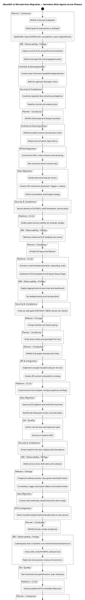

```plantuml
@startuml
title Monolith to Microservices Migration — Swimlane (Role Agents across Phases)

skinparam BackgroundColor white
skinparam activity {
  BorderColor #888
  BarColor #555
}
skinparam partition {
  BorderColor #999
}

start

' -------------------------
' PHASE 1 — DISCOVER & BASELINE
' -------------------------
partition "Planner / Conductor" {
  :[PHASE 1] Discover & Baseline;
  :Define goals & scope (parity vs redesign);
  :Stakeholder map and RAID (risks, assumptions, issues, dependencies);
}
partition "SRE / Observability / FinOps" {
  :Capture current SLOs and performance baselines;
  :Define trace/span IDs and propagation policy;
}
partition "Architect & Decomposition" {
  :Context map of domains/capabilities/dependencies;
  :ADRs for approach (Strangler, ACLs);
}
partition "Security & Compliance" {
  :Inventory regulated data and privacy obligations;
  :Baseline controls and evidence plan;
}

' -------------------------
' PHASE 2 — DECOMPOSE & DESIGN GUARDRAILS
' -------------------------
partition "Planner / Conductor" {
  :[PHASE 2] Decompose & Design Guardrails;
}
partition "Architect & Decomposition" {
  :Define bounded contexts and extraction order;
  :Design anti-corruption layers (ACLs);
}
partition "API & Integration" {
  :Contract-first APIs / event schemas and versioning;
  :Plan consumer-driven contract tests;
}
partition "Data Migration" {
  :Decide data ownership per service;
  :Choose CDC mechanism (log-based / triggers / outbox);
  :Define reconciliation and lineage strategy;
}
partition "Security & Compliance" {
  :Service identity (mTLS/OIDC), authZ boundaries, secrets policy;
}
partition "Platform / CI-CD" {
  :Golden paths (service scaffold, IaC modules, GitOps);
}
partition "SRE / Observability / FinOps" {
  :Telemetry model and SLO templates per service;
}

' -------------------------
' PHASE 3 — PREPARE THE PLATFORM
' -------------------------
partition "Planner / Conductor" {
  :[PHASE 3] Prepare the Platform;
}
partition "Platform / CI-CD" {
  :Provision runtime (Kubernetes/ACA), networking, mesh;
  :Implement CI/CD templates (trunk-based, feature flags);
}
partition "SRE / Observability / FinOps" {
  :Deploy logging/metrics/traces stack and dashboards;
  :Set budgets/quotas and cost guardrails;
}
partition "Security & Compliance" {
  :Policy-as-code gates (SAST/DAST, SBOM, secrets, IaC checks);
}
partition "Release / Change" {
  :Change calendar and release gating;
}
partition "Planner / Conductor" {
  :Verify entry criteria and greenlight first slice;
}

' -------------------------
' PHASE 4 — STRANGLER EXECUTION (PER SLICE)
' -------------------------
partition "Planner / Conductor" {
  :[PHASE 4] Strangler Execution (Per Slice);
}
partition "API & Integration" {
  :Implement strangler facade/routing for the slice;
  :Finalize API contract and publish to catalog;
}
partition "Platform / CI-CD" {
  :Create service from template; configure pipelines and flags;
}
partition "Data Migration" {
  :Stand up CDC pipeline; dual-read then dual-write;
  :Backfill with idempotent writes; reconcile deltas;
}
partition "QA / Quality" {
  :Author contract tests and regression pack;
  :Execute on shadow traffic;
}
partition "Security & Compliance" {
  :Threat model for the slice; validate authZ boundaries;
}
partition "SRE / Observability / FinOps" {
  :Define service SLOs; draft alerts and runbooks;
}
partition "Release / Change" {
  :Progressive delivery (canary / blue-green) and health checks;
  :If unhealthy, trigger automated rollback and incident review;
}
partition "Data Migration" {
  :Cutover data ownership; disable dual-write when steady;
}
partition "API & Integration" {
  :Retire monolith endpoint behind facade (route to new service);
}

' -------------------------
' PHASE 5 — SCALE, HARDEN & OPTIMIZE
' -------------------------
partition "Planner / Conductor" {
  :[PHASE 5] Scale, Harden & Optimize;
}
partition "SRE / Observability / FinOps" {
  :Load/capacity tests vs baseline; tune retries/timeouts/backpressure;
  :Chaos drills; verify RTO/RPO; calibrate SLOs;
  :Right-size and autoscale; review unit economics;
}
partition "QA / Quality" {
  :Non-functional tests (performance, soak, resiliency);
}
partition "Platform / CI-CD" {
  :Improve pipeline MTTR; remediate flaky tests;
}

' -------------------------
' PHASE 6 — ORG READINESS & HANDOVER
' -------------------------
partition "Planner / Conductor" {
  :[PHASE 6] Org Readiness & Handover;
  :Stakeholder communications; release notes; training plan;
}
partition "Security & Compliance" {
  :Collect evidence (audit trails, data maps, control pass-rate);
}
partition "Release / Change" {
  :Operational handover; support readiness and change approvals;
}

' -------------------------
' PHASE 7 — RETIRE THE MONOLITH
' -------------------------
partition "Planner / Conductor" {
  :[PHASE 7] Retire the Monolith;
  :Define decommission plan and rollback window;
}
partition "Platform / CI-CD" {
  :Remove routes to monolith components; infrastructure teardown;
}
partition "Data Migration" {
  :Archive/retain legacy data per policy; close lineage;
}
partition "Security & Compliance" {
  :License retirement; access revocation; final attestations;
}
partition "SRE / Observability / FinOps" {
  :Post-migration review (SLOs, cost/tx, DORA); lessons learned;
}
partition "Planner / Conductor" {
  stop
}

@enduml
```