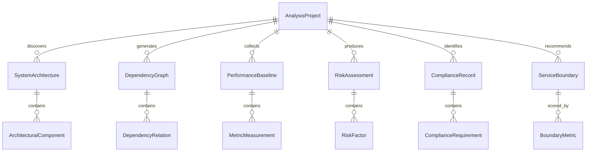

# Data Model: System Discovery and Baseline Assessment

**Feature**: Epic 1.1 - System Discovery and Baseline Assessment  
**Date**: November 17, 2025  
**Phase**: Phase 1 - Design & Contracts

## Entity Relationship Overview



## Core Entities

### AnalysisProject

Represents a single monolith analysis session with metadata, configuration, and progress tracking.

**Fields**:
- `id`: UUID (Primary Key)
- `name`: String (Required, 1-255 chars) - Human-readable project name
- `description`: Text (Optional) - Project description and context
- `repository_url`: String (Required) - Git repository URL for source code
- `repository_branch`: String (Default: "main") - Target branch for analysis
- `target_system_type`: Enum (Required) - ["spring_boot", "spring_mvc", "java_ee", "other"]
- `analysis_configuration`: JSONB (Required) - Tool-specific configuration settings
- `status`: Enum (Required) - ["queued", "running", "completed", "failed", "cancelled"]
- `progress_percentage`: Integer (0-100) - Current analysis completion percentage
- `created_at`: Timestamp (Required) - Project creation time
- `updated_at`: Timestamp (Required) - Last status update time
- `completed_at`: Timestamp (Optional) - Analysis completion time
- `created_by`: String (Required) - User identifier who initiated analysis
- `validation_status`: Enum - ["pending", "approved", "rejected", "needs_review"]
- `validation_notes`: Text (Optional) - Human validation feedback

**Relationships**:
- One-to-many with SystemArchitecture, DependencyGraph, PerformanceBaseline, RiskAssessment, ComplianceRecord, ServiceBoundary

**Validation Rules**:
- Repository URL must be accessible Git repository
- Analysis configuration must match target system type schema
- Progress percentage must be 0-100
- Status transitions must follow valid state machine

**State Transitions**:
```
queued → running → [completed | failed | cancelled]
completed → running (re-analysis)
```

### SystemArchitecture

Contains discovered architectural patterns, component relationships, and domain boundaries.

**Fields**:
- `id`: UUID (Primary Key)
- `analysis_project_id`: UUID (Foreign Key, Required) - Reference to AnalysisProject
- `architecture_style`: Enum (Required) - ["layered", "modular_monolith", "microservices", "hybrid", "unknown"]
- `domain_model`: JSONB (Required) - Discovered bounded contexts and aggregates
- `c4_model`: JSONB (Required) - Context, Container, Component, Code level diagrams
- `technology_stack`: JSONB (Required) - Identified frameworks, libraries, dependencies
- `architectural_patterns`: JSONB (Required) - Detected design patterns and anti-patterns
- `quality_metrics`: JSONB (Required) - Code quality, maintainability, technical debt scores
- `documentation_coverage`: Float (0.0-1.0) - Percentage of documented components
- `test_coverage`: Float (0.0-1.0) - Code test coverage percentage
- `generated_diagrams`: JSONB (Required) - PlantUML, Mermaid diagram definitions
- `discovered_at`: Timestamp (Required) - Analysis completion time
- `tool_versions`: JSONB (Required) - Analysis tool versions used

**Relationships**:
- Many-to-one with AnalysisProject
- One-to-many with ArchitecturalComponent

**Validation Rules**:
- Domain model must contain at least one bounded context
- C4 model must include Context and Container levels
- Quality metrics must include maintainability index and technical debt ratio
- Tool versions must track all static analysis tools used

### DependencyGraph

Maps all identified dependencies between modules, external systems, and data sources.

**Fields**:
- `id`: UUID (Primary Key)
- `analysis_project_id`: UUID (Foreign Key, Required) - Reference to AnalysisProject
- `graph_type`: Enum (Required) - ["static", "runtime", "combined"]
- `nodes`: JSONB (Required) - Graph nodes (modules, services, databases, external systems)
- `edges`: JSONB (Required) - Graph edges (dependencies, communications, data flows)
- `coupling_metrics`: JSONB (Required) - Coupling strength measurements between components
- `external_dependencies`: JSONB (Required) - External system integrations and APIs
- `data_dependencies`: JSONB (Required) - Database schemas, queries, data flows
- `circular_dependencies`: JSONB (Required) - Identified circular dependency cycles
- `critical_path_analysis`: JSONB (Required) - Most critical dependency paths
- `confidence_score`: Float (0.0-1.0) - Overall dependency identification confidence
- `generated_at`: Timestamp (Required) - Graph generation time
- `validation_status`: Enum - ["unvalidated", "validated", "disputed"]

**Relationships**:
- Many-to-one with AnalysisProject
- One-to-many with DependencyRelation

**Validation Rules**:
- Nodes must include source_type, name, and location information
- Edges must specify dependency_type, strength, and direction
- Coupling metrics must include afferent/efferent coupling measurements
- Confidence score must reflect validation methodology accuracy

### PerformanceBaseline

Stores collected metrics including response times, throughput measurements, and resource utilization.

**Fields**:
- `id`: UUID (Primary Key)
- `analysis_project_id`: UUID (Foreign Key, Required) - Reference to AnalysisProject
- `collection_period_start`: Timestamp (Required) - Baseline collection start time
- `collection_period_end`: Timestamp (Required) - Baseline collection end time
- `environment_type`: Enum (Required) - ["production", "staging", "development", "synthetic"]
- `load_characteristics`: JSONB (Required) - Traffic patterns, user behavior, seasonal variations
- `response_time_metrics`: JSONB (Required) - P50, P95, P99 latency measurements with confidence intervals
- `throughput_metrics`: JSONB (Required) - Requests per second, transactions per minute
- `error_rate_metrics`: JSONB (Required) - Error frequencies by type and severity
- `resource_utilization`: JSONB (Required) - CPU, memory, disk, network usage patterns
- `database_performance`: JSONB (Required) - Query performance, connection pool metrics
- `external_service_metrics`: JSONB (Required) - Response times for external dependencies
- `statistical_confidence`: Float (0.0-1.0) - Statistical confidence in measurements (95% target)
- `sample_size`: Integer (Required) - Number of measurements collected
- `data_quality_score`: Float (0.0-1.0) - Assessment of baseline data quality

**Relationships**:
- Many-to-one with AnalysisProject
- One-to-many with MetricMeasurement

**Validation Rules**:
- Collection period must be at least 24 hours for production environments
- Statistical confidence must be ≥0.95 for enterprise use
- Sample size must meet minimum statistical requirements
- All percentile measurements must include confidence intervals

### RiskAssessment

Contains categorized risks with probability/impact scores and recommended mitigation strategies.

**Fields**:
- `id`: UUID (Primary Key)
- `analysis_project_id`: UUID (Foreign Key, Required) - Reference to AnalysisProject
- `overall_risk_score`: Float (0.0-10.0) - Composite risk assessment score
- `migration_complexity_score`: Float (0.0-10.0) - Technical migration difficulty assessment
- `business_impact_score`: Float (0.0-10.0) - Business disruption risk assessment
- `technical_debt_score`: Float (0.0-10.0) - Technical debt risk assessment
- `coupling_risk_factors`: JSONB (Required) - High coupling areas and extraction risks
- `dependency_risk_factors`: JSONB (Required) - External dependency risks and failure modes
- `data_migration_risks`: JSONB (Required) - Data consistency and migration complexity risks
- `performance_risks`: JSONB (Required) - Performance degradation and scalability risks
- `security_risks`: JSONB (Required) - Security vulnerabilities and compliance risks
- `organizational_risks`: JSONB (Required) - Team readiness and knowledge transfer risks
- `mitigation_strategies`: JSONB (Required) - Recommended risk mitigation approaches
- `go_no_go_recommendation`: Enum (Required) - ["go", "no_go", "conditional_go"]
- `recommendation_rationale`: Text (Required) - Detailed reasoning for recommendation
- `assessed_at`: Timestamp (Required) - Risk assessment completion time
- `reviewed_by`: String (Optional) - Architect who reviewed assessment

**Relationships**:
- Many-to-one with AnalysisProject
- One-to-many with RiskFactor

**Validation Rules**:
- Risk scores must use quantitative scoring framework combining coupling strength, dependencies, and complexity
- Mitigation strategies must be specific and actionable
- Go/no-go recommendation must align with risk score thresholds
- All HIGH risk factors must have corresponding mitigation strategies

### ComplianceRecord

Tracks identified regulatory requirements, data classifications, and audit evidence.

**Fields**:
- `id`: UUID (Primary Key)
- `analysis_project_id`: UUID (Foreign Key, Required) - Reference to AnalysisProject
- `regulatory_frameworks`: JSONB (Required) - Applicable regulations (GDPR, HIPAA, SOX, etc.)
- `data_classifications`: JSONB (Required) - PII, PHI, financial data inventories
- `privacy_obligations`: JSONB (Required) - Data processing purposes, retention periods
- `security_controls`: JSONB (Required) - Implemented security measures and controls
- `audit_requirements`: JSONB (Required) - Audit trail and evidence requirements
- `compliance_gaps`: JSONB (Required) - Identified compliance deficiencies
- `remediation_plans`: JSONB (Required) - Plans to address compliance gaps
- `evidence_artifacts`: JSONB (Required) - Supporting documentation and evidence
- `compliance_status`: Enum (Required) - ["compliant", "non_compliant", "partial", "unknown"]
- `last_assessment_date`: Timestamp (Required) - Most recent compliance assessment
- `next_review_date`: Timestamp (Required) - Scheduled next compliance review
- `assessor`: String (Required) - Compliance officer or auditor identifier

**Relationships**:
- Many-to-one with AnalysisProject
- One-to-many with ComplianceRequirement

**Validation Rules**:
- Data classifications must be comprehensive and accurate
- Privacy obligations must specify legal basis for processing
- All compliance gaps must have remediation plans with timelines
- Evidence artifacts must be tamper-evident and timestamped

### ServiceBoundary

Represents potential microservice extraction points with complexity scoring and dependency analysis.

**Fields**:
- `id`: UUID (Primary Key)
- `analysis_project_id`: UUID (Foreign Key, Required) - Reference to AnalysisProject
- `boundary_name`: String (Required, 1-255 chars) - Proposed service boundary name
- `boundary_description`: Text (Required) - Business capability and scope description
- `domain_context`: String (Required) - Domain-driven design bounded context
- `included_components`: JSONB (Required) - Code modules and classes included
- `api_surface`: JSONB (Required) - Proposed public interfaces and contracts
- `data_ownership`: JSONB (Required) - Database tables and schemas owned
- `external_dependencies`: JSONB (Required) - Required external system integrations
- `coupling_strength`: Float (0.0-10.0) - Coupling with other potential services
- `cohesion_score`: Float (0.0-10.0) - Internal cohesion of boundary components
- `extraction_complexity`: Enum (Required) - ["low", "medium", "high", "very_high"]
- `effort_estimate_days`: Integer (Required) - Estimated extraction effort in person-days
- `risk_factors`: JSONB (Required) - Specific risks associated with extraction
- `prerequisites`: JSONB (Required) - Required refactoring or preparation work
- `migration_order`: Integer (Optional) - Recommended extraction sequence order
- `confidence_level`: Float (0.0-1.0) - Confidence in boundary recommendation
- `architect_approval`: Enum - ["pending", "approved", "rejected", "needs_revision"]
- `approval_notes`: Text (Optional) - Architect feedback and comments

**Relationships**:
- Many-to-one with AnalysisProject
- One-to-many with BoundaryMetric

**Validation Rules**:
- Boundary must have clear business capability focus
- API surface must specify RESTful or event-driven interfaces
- Data ownership must avoid shared database anti-patterns
- Effort estimates must be based on historical migration data
- High complexity boundaries must have detailed prerequisite plans

## Supporting Entities

### ArchitecturalComponent

**Fields**:
- `id`: UUID (Primary Key)
- `system_architecture_id`: UUID (Foreign Key, Required)
- `component_name`: String (Required)
- `component_type`: Enum - ["controller", "service", "repository", "entity", "configuration"]
- `package_path`: String (Required)
- `responsibilities`: JSONB (Required)
- `dependencies`: JSONB (Required)
- `quality_metrics`: JSONB (Required)

### DependencyRelation

**Fields**:
- `id`: UUID (Primary Key)
- `dependency_graph_id`: UUID (Foreign Key, Required)
- `source_component`: String (Required)
- `target_component`: String (Required)
- `dependency_type`: Enum (Required) - ["compile", "runtime", "test", "provided"]
- `strength`: Float (0.0-10.0)
- `frequency`: Integer (Optional) - Runtime call frequency

### MetricMeasurement

**Fields**:
- `id`: UUID (Primary Key)
- `performance_baseline_id`: UUID (Foreign Key, Required)
- `metric_name`: String (Required)
- `metric_value`: Float (Required)
- `confidence_interval_lower`: Float (Optional)
- `confidence_interval_upper`: Float (Optional)
- `measurement_timestamp`: Timestamp (Required)
- `measurement_context`: JSONB (Optional)

### RiskFactor

**Fields**:
- `id`: UUID (Primary Key)
- `risk_assessment_id`: UUID (Foreign Key, Required)
- `risk_category`: Enum (Required) - ["technical", "business", "organizational", "compliance"]
- `risk_description`: Text (Required)
- `probability`: Float (0.0-1.0)
- `impact`: Float (0.0-10.0)
- `mitigation_strategy`: Text (Required)

### ComplianceRequirement

**Fields**:
- `id`: UUID (Primary Key)
- `compliance_record_id`: UUID (Foreign Key, Required)
- `requirement_framework`: String (Required) - "GDPR", "HIPAA", etc.
- `requirement_reference`: String (Required) - Specific regulation reference
- `requirement_description`: Text (Required)
- `current_compliance_status`: Enum (Required) - ["met", "not_met", "partial", "not_applicable"]
- `evidence_references`: JSONB (Optional)

### BoundaryMetric

**Fields**:
- `id`: UUID (Primary Key)
- `service_boundary_id`: UUID (Foreign Key, Required)
- `metric_type`: Enum (Required) - ["coupling", "cohesion", "complexity", "size"]
- `metric_value`: Float (Required)
- `calculation_method`: String (Required)
- `benchmark_comparison`: Float (Optional)

## Database Indexes

### Performance Optimization Indexes

```sql
-- Analysis project queries
CREATE INDEX idx_analysis_project_status ON analysis_project(status);
CREATE INDEX idx_analysis_project_created_by ON analysis_project(created_by);
CREATE INDEX idx_analysis_project_created_at ON analysis_project(created_at DESC);

-- Dependency graph queries
CREATE INDEX idx_dependency_graph_project ON dependency_graph(analysis_project_id);
CREATE INDEX idx_dependency_graph_type ON dependency_graph(graph_type);

-- Performance baseline queries
CREATE INDEX idx_performance_baseline_project ON performance_baseline(analysis_project_id);
CREATE INDEX idx_performance_baseline_environment ON performance_baseline(environment_type);

-- Risk assessment queries
CREATE INDEX idx_risk_assessment_project ON risk_assessment(analysis_project_id);
CREATE INDEX idx_risk_assessment_score ON risk_assessment(overall_risk_score DESC);

-- Service boundary queries
CREATE INDEX idx_service_boundary_project ON service_boundary(analysis_project_id);
CREATE INDEX idx_service_boundary_complexity ON service_boundary(extraction_complexity);
CREATE INDEX idx_service_boundary_approval ON service_boundary(architect_approval);
```

### Full-Text Search Indexes

```sql
-- Component and boundary search
CREATE INDEX idx_architectural_component_search ON architectural_component 
USING gin(to_tsvector('english', component_name || ' ' || coalesce(responsibilities::text, '')));

CREATE INDEX idx_service_boundary_search ON service_boundary 
USING gin(to_tsvector('english', boundary_name || ' ' || boundary_description));
```

## Data Validation Constraints

### Business Rules Enforcement

```sql
-- Analysis project validation
ALTER TABLE analysis_project ADD CONSTRAINT chk_progress_range 
CHECK (progress_percentage >= 0 AND progress_percentage <= 100);

-- Performance baseline validation
ALTER TABLE performance_baseline ADD CONSTRAINT chk_collection_period 
CHECK (collection_period_end > collection_period_start);

ALTER TABLE performance_baseline ADD CONSTRAINT chk_statistical_confidence 
CHECK (statistical_confidence >= 0.0 AND statistical_confidence <= 1.0);

-- Risk assessment validation
ALTER TABLE risk_assessment ADD CONSTRAINT chk_risk_scores 
CHECK (overall_risk_score >= 0.0 AND overall_risk_score <= 10.0);

-- Service boundary validation
ALTER TABLE service_boundary ADD CONSTRAINT chk_coupling_strength 
CHECK (coupling_strength >= 0.0 AND coupling_strength <= 10.0);

ALTER TABLE service_boundary ADD CONSTRAINT chk_confidence_level 
CHECK (confidence_level >= 0.0 AND confidence_level <= 1.0);
```

This data model supports all functional requirements from the specification and enables the two-pronged analysis strategy with comprehensive tracking of static analysis, runtime behavior, and gap analysis results.